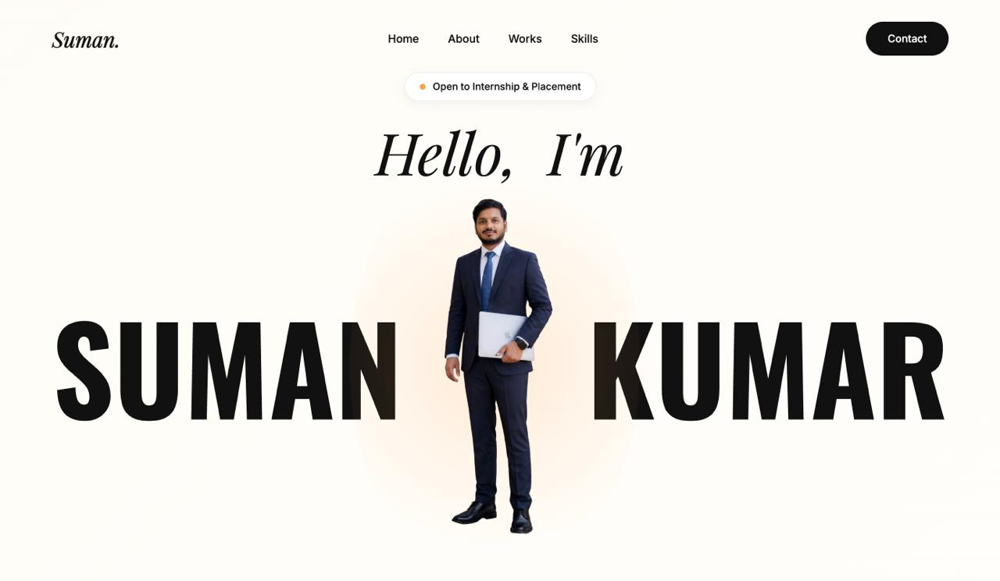

# Suman Kumar - Portfolio Website
Passionate Full-Stack Web Developer & Problem Solver.

# Portfolio Website

## 🌐 Live Website
👉 https://kumarsuman-dev.github.io/portfolio/

## 📸 Website Preview

## 🛠️ Tech Stack
- HTML
- CSS
- JavaScript

## 👤 Author
Suman Sanu

## 🛠 Tech Stack
- **Frontend:** HTML5, CSS3, JavaScript (ES6+)
- **Styling:** Custom CSS (Responsive Design, Flexbox, Grid)
- **Icons:** Font Awesome
- **Fonts:** Google Fonts (Oswald, Playfair Display, Inter)

## ✨ Features
- **Responsive Design:** Optimized for Desktop, Tablet, and Mobile.
- **Interactive UI:** Smooth scrolling, hover effects, and mobile navigation.
- **Projects Showcase:** Highlighted projects with descriptions and links.
- **Downloadable Resume:** Direct link to my CV.
- **Contact:** Email and Social Media links.

## 📂 Folder Structure
- `css/` - Stylesheets
- `js/` - JavaScript files
- `images/` - Project assets and profile pictures
- `resume/` - PDF Resume files
- `index.html` - Main entry point

---
© 2026 Suman Kumar
